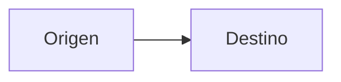

# Presentaciones de Ingeniería de Software Moderna

## Alcance del repositorio

Este repositorio contiene las salidas HTML de las presentaciones de Ingeniería de Software Moderna (ISM). Los markdowns fuente viven en el vault de Obsidian, bajo `Diapositivas/Primera mitad/`, y Advanced Slides los exporta como presentaciones Reveal.js.

El markdown es la fuente de verdad. No edites `index.html` para cambiar el contenido de una clase. La siguiente exportación desde Obsidian sobrescribirá esos cambios.

## Estado actual del material

| Markdown fuente | Tema | Salida HTML |
| --- | --- | --- |
| `Primera mitad/S1/S1 - C1 - Bienvenida al curso y reglas de juego.md` | Bienvenida, reglas y logística | `bienvenida/index.html` |
| `Primera mitad/S1/S1 - C2 - El proyecto.md` | Proyecto, módulos y modelado inicial | `proyecto/index.html` |
| `Primera mitad/S2/S2 - C1 - HTML, CSS y Bootstrap.md` | Fundamentos de frontend | `html-css-bootstrap/index.html` |
| `Primera mitad/S2/S2 - C2 - TypeScript.md` | Tipado y fundamentos de TypeScript | `typescript/index.html` |
| `Primera mitad/S3 y S4/S3 - C1 y C2 - Angular.md` | Angular, arquitectura frontend y práctica | `angular/index.html` |
| `Primera mitad/S5/S5 - C1 - Backend y Arquitectura por capas.md` | Backend y arquitectura por capas | Aún no se ha exportado |

Actualmente hay cinco presentaciones HTML exportadas. La clase de Backend solo tiene la agenda y los encabezados principales. Trátala como material en preparación, no como contenido terminado.

## Secuencia y contenido de las clases

### S1 C1: bienvenida y reglas de juego

Presenta el curso, construye comunidad y fija las reglas de trabajo. Incluye asistencia, comunicación, evaluación, trabajo en grupos, uso de GitHub, uso responsable de IA y las primeras tareas.

Puntos del curso que deben conservarse:

- La asistencia es obligatoria y exige al menos 80%.
- Las inasistencias justificadas se reportan dentro de los tres días calendario siguientes.
- La mayoría de las entregas se hace por GitHub.
- El proyecto combina trabajo individual y grupal. Cada estudiante desarrolla el front y el back de un módulo funcional.
- El uso de IA está permitido con restricciones. Los prompts y conversaciones pueden formar parte de los entregables.
- Algunas entregas pueden requerir sustentación oral.

### S1 C2: el proyecto

Explica cómo convertir el enunciado en un diseño inicial. Cubre repositorios individuales y grupales, entidades, atributos, relaciones, reglas de negocio, supuestos, prototipado estático con HTML y Bootstrap, módulos funcionales y diagramas de dominio y vista funcional.

Las tareas incluyen un GIST público, la wiki del repositorio, los diagramas y las historias de usuario. La validación con el profesor es un paso explícito antes de continuar.

### S2 C1: HTML, CSS y Bootstrap

Introduce la Web y las responsabilidades de HTML, CSS y JavaScript. Luego presenta Bootstrap, sus componentes y su grilla de 12 columnas.

- HTML aporta estructura, semántica y DOM.
- CSS define la apariencia.
- JavaScript agrega comportamiento e interacción.
- Bootstrap ofrece estilos y componentes reutilizables.

La clase termina con un bono para construir un sitio propio o un portafolio usando Bootstrap y un GIST de referencia.

### S2 C2: TypeScript

Parte de los problemas del tipado dinámico de JavaScript y presenta TypeScript como verificación antes de ejecutar. Cubre `tsc`, tipos, inferencia, funciones, interfaces, uniones, condicionales, ciclos y operaciones sobre arreglos.

La práctica conecta TypeScript con una página HTML, Bootstrap, un arreglo alojado en un GIST, `script.ts`, `tsconfig.json`, `tsc` y Live Server.

### S3 y S4: Angular

Continúa desde HTML, JavaScript y TypeScript para explicar por qué una interfaz grande necesita una estructura. Cubre frameworks de frontend, Angular, npm, Angular CLI, aplicaciones standalone, templates, estilos, componentes, modelos, `httpResource`, APIs externas y descomposición.

La arquitectura pedagógica de esta clase es:

```text
Usuario → vista → componente → capa de datos → API externa
```

El template muestra datos, emite eventos y controla qué se ve. El componente coordina la vista. La capa de datos realiza HTTP y puede ser un `httpResource` dentro del componente o un servicio dedicado. El API vive fuera de Angular.

Por ahora, los GISTs simulan una fuente externa de solo lectura. La clase usa `httpResource` para lecturas y reserva creación, edición y eliminación con `HttpClient` para una etapa posterior. La práctica pide crear un proyecto Angular en el repositorio individual, definir tres modelos, configurar environments, instalar Bootstrap y adaptar el tutorial a las entidades del proyecto. La tarea asociada es el Release 1.

### S5 C1: Backend y arquitectura por capas

El markdown actual solo define la agenda: backend, arquitectura por capas, frameworks de backend y Spring Boot. Antes de exportarlo o ampliar sus instrucciones, completa el contenido de cada sección y valida que conecte con la arquitectura frontend presentada en Angular.

## Organización de una presentación exportada

Cada carpeta exportada contiene:

- `index.html`, con las diapositivas y la inicialización de Reveal.js.
- `css/`, con `layout.css`, `mattropolis.css` y `vs2015.css`.
- `dist/`, con Reveal.js, temas, fuentes y Font Awesome.
- `plugin/`, con los plugins de Reveal.js usados por Advanced Slides.
- Imágenes específicas de la clase junto a `index.html`.

Los directorios `dist/` y `plugin/` son copias locales del runtime de Reveal.js. Se repiten en cada presentación para que pueda abrirse de manera autónoma. No son el contenido académico y no se deben editar salvo que el cambio requiera modificar el runtime compartido.

## Convenciones de autoría

Los markdowns fuente siguen estas convenciones:

- El frontmatter usa `bg: "#2E3440"` y `highlightTheme: monokai`.
- `---` separa las diapositivas.
- El primer `#` es el título de la clase. Los `##` son títulos de diapositiva y los `###` organizan contenido dentro de una misma diapositiva.
- Los bullets son recordatorios para la explicación oral, no un guion completo. Mantén una idea por diapositiva y evita párrafos largos.
- El material se escribe principalmente en español. Conserva en inglés nombres de APIs, comandos, etiquetas HTML, tipos y mensajes de error.
- Las clases alternan explicación corta, diagramas, capturas, demostraciones en vivo, práctica y preguntas.
- Las diapositivas de demo dicen qué se verá en VSCode. No copies el paso a paso completo ni el código del demo a la presentación.
- Usa bloques de código solo cuando la sintaxis misma sea parte del concepto que se está enseñando.
- Usa Mermaid para explicar relaciones, flujo de datos, capas o árboles de componentes.
- Las imágenes se insertan con wikilinks de Obsidian, por ejemplo `![[imagen.png|500]]`.
- Se pueden usar tablas HTML con `font-size` reducido cuando una comparación necesite varias columnas.
- Para diagramas Mermaid grandes, usa un contenedor con ancho y escala, y revisa que no quede recortado al exportar.

Ejemplo de contenedor para un diagrama ancho:

~~~~html
<div style="width: 100%; margin-left: -10%; transform: scale(1.15); transform-origin: center;">



</div>
~~~~

## Flujo de trabajo

1. Edita primero el markdown en Obsidian.
2. Conserva el estilo corto, concreto e ilustrativo de las clases existentes.
3. Exporta con Advanced Slides a la carpeta de la presentación correspondiente.
4. Copia o conserva las imágenes que el HTML referencia de forma local.
5. Abre el `index.html` generado y revisa visualmente imágenes, Mermaid, bloques de código, tablas y contenido con estilos inline.
6. Comprueba que las rutas relativas a CSS, JavaScript e imágenes sigan funcionando.
7. Ejecuta `git diff --check` antes de entregar cambios en este repositorio.

No hay un script de build o pruebas propio en la raíz. La validación principal es la exportación desde Obsidian y una revisión visual de cada HTML.

## Texto y documentación

Aplica la skill `unslop` al escribir o revisar prosa para este proyecto. Conserva el significado y el tono docente. Usa palabras concretas, voz activa y frases breves. No cambies nombres de archivos, URLs, comandos ni bloques de código al limpiar la redacción.
